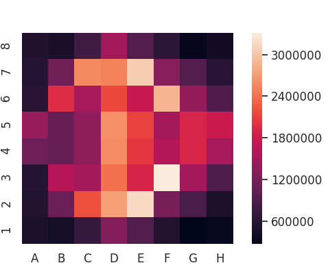
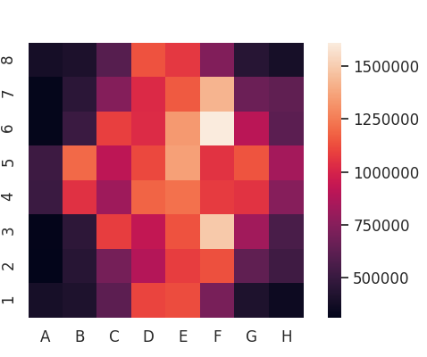

# ChessData
This repository was made to visualize arbitrary patterns in Chess gathered and anaylzed from millions of games.
 
 

### Tools Used
- [Seaborn Heatmaps](https://seaborn.pydata.org/generated/seaborn.heatmap.html)
- [Lichess Database](https://database.lichess.org/)

 
 

## Heatmap of Chess Moves

Gathered from 10.8 million games, every heatmap visualizes the location of peices or the location of certain game events.
 
 
 

### Heatmap of White and Black Kings

 
 

### Heatmap of White and Black Queens

 
 

### Heatmap of White and Black Knights
##### ( 1.2 = 12 million moves)

 
 

### Heatmap of Captures
##### ( 1.0 = 10 million moves)

 
 

### Heatmap of Checks
##### (Squares in which a piece threatened a King)

